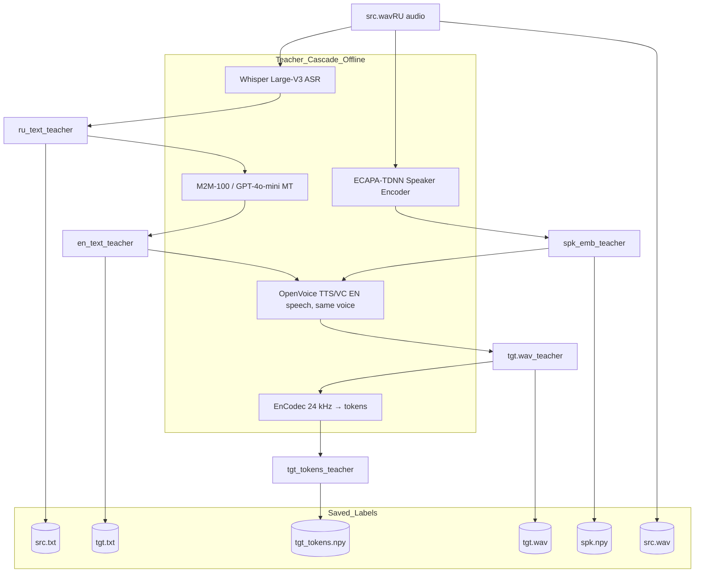

```mermaid
flowchart TD
    A[src.wavRU audio] --> B[Whisper Large-V3 ASR]
    B --> C[ru_text_teacher]

    C --> D[M2M-100 / GPT-4o-mini MT]
    D --> E[en_text_teacher]

    A --> F[ECAPA-TDNN Speaker Encoder]
    F --> G[spk_emb_teacher]

    E --> H[OpenVoice TTS/VC EN speech, same voice]
    G --> H
    H --> I[tgt.wav_teacher]

    I --> J[EnCodec 24 kHz → tokens]
    J --> K[tgt_tokens_teacher]

    %% Storage nodes
    C --> S1[(src.txt)]
    E --> S2[(tgt.txt)]
    G --> S3[(spk.npy)]
    I --> S4[(tgt.wav)]
    K --> S5[(tgt_tokens.npy)]
    A --> S0[(src.wav)]

    subgraph Teacher_Cascade_Offline
        B
        D
        F
        H
        J
    end

    subgraph Saved_Labels
        S0
        S1
        S2
        S3
        S4
        S5
    end
```